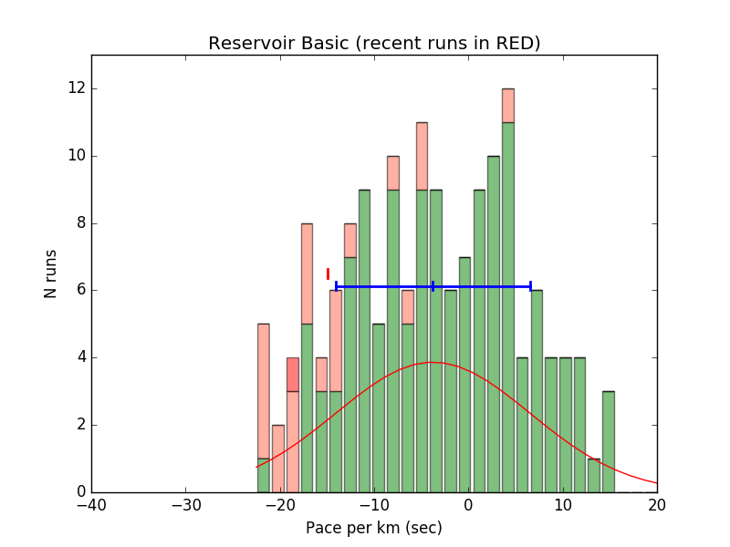

### Rungraph

A python program to analyze your data from [Mappedometer.com](http://www.mappedometer.com/).

Mappedometer is a web based site which let's you set up routes on Google Maps, and enter your run times
(without needing to run with a phone or a GPS watch).  Here is an example histogram (most recent 15% of your
runs are in red)



## Features

* Accumulates stats for the 16 runs you have logged the most
* Computes number of runs, and min/mean/max pace
* Displays your pace history, and pace histogram for any route.
* Compare your routes:
    * Displays a horizontal box plot of all your routes
    * Display your pace vs. elevation gain of the routes
    * Compare pace for your 3K vs 5K runs
    * Display a histogram of all your runs
* Determine how/if your pace correlates with your number of runs per week.
* Plot your minutes per week

## Usage

1. From your "Activity Log" in mappedometer, click "Export" and save as "ActivityLog.csv" (the default name)
2. You need to edit the file *elev_gain.csv* to include elevation gains (available on Mappedometer) for
your routes.

2. \>python rungr.py

```

707  runs
636  valid runs
32  routes
                                                   Pace
  i     Route                               N     min  avg   max    sd
--------------------------------------------------------------------------
  0 Your first route                        159   4:29  4:52  5:26  11.1
  1 Your second route                       158   4:37  4:56  5:53  10.3


  etc...


 15 Your 16th route                           5   4:42  4:46  4:49   3.3


Select a route to graph: (-1 to quit, 80 = freq, 81 = rate, 99 for global plots)

```

3.  Select your route (integer between 0 and 15) for analysis or other numberical commands indicated.

4. enter -1 to quit

